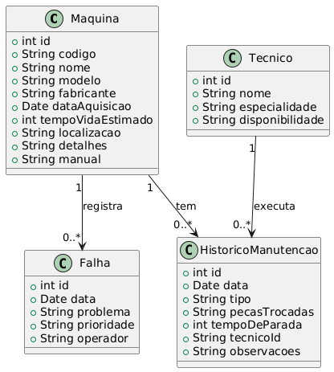
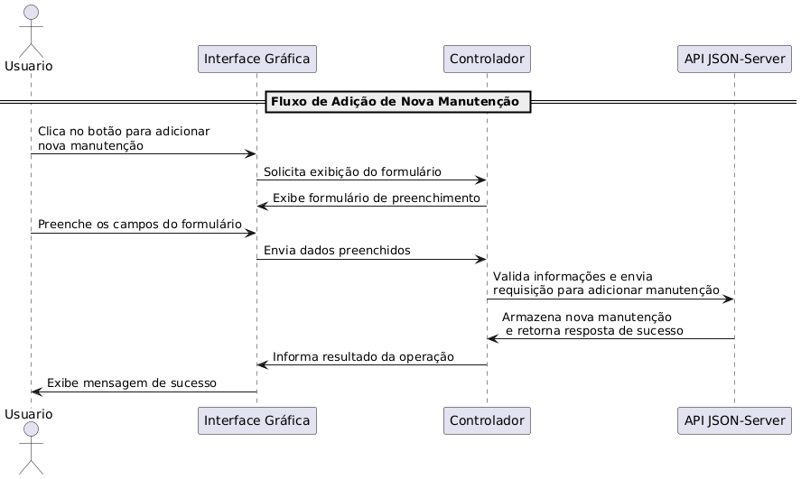

# Sistema de Manutenção Preventiva e Corretiva

## 1. Definição do Tema
O **Sistema de Manutenção Preventiva e Corretiva** é um software destinado ao gerenciamento do ciclo de vida de máquinas e equipamentos industriais, com foco em minimizar o tempo de inatividade e otimizar a performance operacional. Ele permite o controle das manutenções preventivas (realizadas regularmente para evitar falhas) e corretivas (realizadas após uma falha). O sistema também inclui funcionalidades para registrar falhas, gerenciar técnicos, gerar relatórios e acompanhar indicadores de desempenho, como o **MTTR** (Mean Time to Repair - Tempo Médio de Reparo) e o **MTBF** (Mean Time Between Failures - Tempo Médio Entre Falhas).

## 2. Análise de Requisitos e Escopo

### Funcionalidades Principais:

#### Gerenciamento de Máquinas e Equipamentos:
- Cadastro de máquinas, incluindo especificações técnicas, data de aquisição e localização.
- Visualização e edição de informações de máquinas.

#### Registro e Controle de Manutenções:
- Registro de manutenções preventivas e corretivas.
- Histórico completo de manutenções para cada máquina.
- Registro de peças substituídas e tempo de inatividade.

#### Gerenciamento de Falhas:
- Registro de falhas ocorridas, classificando a severidade e identificando o operador.
- Controle de falhas por máquina.

#### Gerenciamento de Técnicos:
- Cadastro de técnicos, incluindo suas especialidades e disponibilidade.

#### Relatórios e Indicadores:
- Geração de relatórios de manutenção, tempo de inatividade, falhas e peças trocadas.
- Cálculo de indicadores como **MTTR** e **MTBF**.

#### Integração com API:
- Utilização de uma API REST (JSON-Server) para armazenar e recuperar dados.

### Requisitos Funcionais:
- O sistema deve permitir o cadastro de máquinas com suas especificações.
- O sistema deve registrar manutenções preventivas e corretivas, associando técnicos e peças trocadas.
- O sistema deve gerar relatórios de manutenção e indicadores de performance.
- O sistema deve oferecer uma interface gráfica intuitiva para o usuário final.

### Requisitos Não Funcionais:
- O sistema deve ser responsivo, com tempo de resposta rápido ao realizar operações com a API.
- A interface deve ser amigável e permitir fácil navegação entre as funcionalidades.
- O sistema deve armazenar e recuperar dados de maneira segura e eficiente.

## 3. Escopo do Projeto

### Objetivos SMART:

- **Desenvolver uma Interface Gráfica Intuitiva (Específico e Atingível)**: Criar uma interface gráfica utilizando Swing que permita gerenciar facilmente o cadastro de máquinas, técnicos e manutenções. A interface deve ser implementada em até 3 meses, garantindo facilidade de uso e boa usabilidade para os operadores do sistema.

- **Implementar Funcionalidades CRUD para Todos os Módulos (Específico, Mensurável e Atingível)**: Desenvolver as operações de **Create**, **Read**, **Update** e **Delete** (CRUD) para os módulos de máquinas, manutenções, falhas e técnicos. Essas funcionalidades devem estar completas dentro de 2 meses, com 100% de cobertura nas operações de cadastro, consulta, atualização e exclusão.

- **Gerar Relatórios e Indicadores de Desempenho (Mensurável e Relevante)**: Criar um sistema de geração de relatórios, com indicadores de performance como **MTTR** (Tempo Médio de Reparo) e **MTBF** (Tempo Médio Entre Falhas), que deve ser funcional dentro de 1 mês após a implementação do CRUD. Esses relatórios serão essenciais para otimizar o tempo de inatividade das máquinas, com um aumento previsto de 15% na eficiência de manutenção.

- **Integrar com API REST para Armazenamento e Recuperação de Dados (Específico e Relevante)**: Implementar a integração com uma API REST para que os dados sejam armazenados e recuperados em tempo real. A meta é concluir essa integração em até 4 meses, garantindo que o sistema seja capaz de operar com dados dinâmicos e atualizados.

- **Realizar Validação e Testes Automatizados (Mensurável, Atingível e Temporal)**: Desenvolver e executar testes unitários e de integração, com uma cobertura mínima de 90% do código, dentro de 1 mês após a finalização da implementação das funcionalidades principais. Esses testes visam garantir a robustez e confiabilidade do sistema em todas as funcionalidades críticas.

#  Levantamento de Recursos 
## 1. Ambiente de Desenvolvimento
- **IDE**: IntelliJ IDEA ou Eclipse.
- **JDK**: Java 17 ou superior.
- **Versionamento de Código**: Git (GitHub ou GitLab).

##  Bibliotecas e Frameworks
- **Interface Gráfica**: Swing (para criar a interface gráfica).
- **Banco de Dados**: MySQL ou PostgreSQL, usando JDBC.
- **Persistência de Dados**: JDBC (conexão com banco de dados).
- **API REST**: Jersey ou Spring Boot (para integração com API REST).
- **Relatórios**: JasperReports (para gerar relatórios de manutenção e desempenho).

##  Ferramentas de Build
- **Maven**: Para gerenciamento de dependências e build do projeto.

## Banco de Dados
- **Tabelas Necessárias**:
  - Máquinas (especificações, data de aquisição, localização).
  - Técnicos (especialidades, disponibilidade).
  - Manutenções (preventivas, corretivas, peças trocadas, tempo de inatividade).
  - Falhas (severidade, operador responsável).

## Testes
- **JUnit**: Para testes unitários.
- **Mockito**: Para mockar dependências em testes.

## Segurança (opcional)
- **Spring Security**: Para controle de acesso (caso seja necessário).

## Servidor e Deploy
- **Servidor de Aplicação**: Apache Tomcat para hospedar a aplicação.
- **Deploy (opcional)**: AWS ou Heroku para deploy em nuvem.

---

## Resumo:
- **Ferramentas de Desenvolvimento**: JDK, IntelliJ ou Eclipse, Git.
- **Bibliotecas**: Swing, JDBC, Spring Boot (ou Jersey), JasperReports.
- **Banco de Dados**: MySQL/PostgreSQL.
- **Testes**: JUnit, Mockito.
- **Segurança**: Spring Security (opcional).
- **Servidor**: Apache Tomcat.

### 4. Modelagem do Sistema

#### Diagrama de Classes

- **Máquinas**: Representa a máquina ou equipamento industrial que será gerenciado.
- **Manutenções**: Registra as manutenções realizadas nas máquinas, sejam preventivas ou corretivas.
- **Técnicos**: Representa o técnico responsável pela execução das manutenções.
- **Falhas**: Registra falhas ou problemas ocorridos em uma máquina.

#### Diagrama de Sequencia (Uso e Fluxo)

